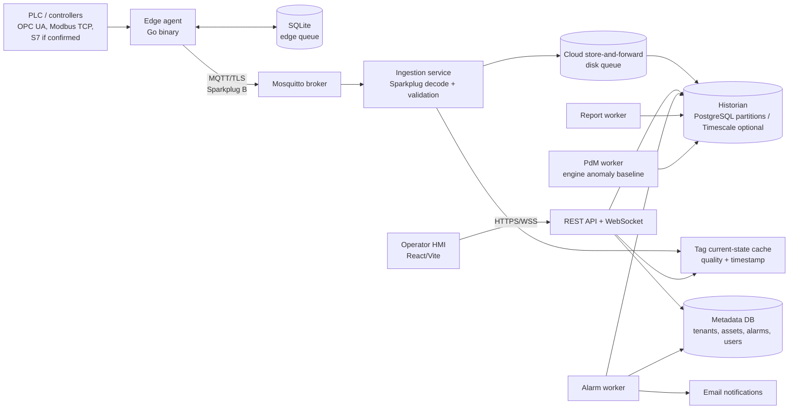
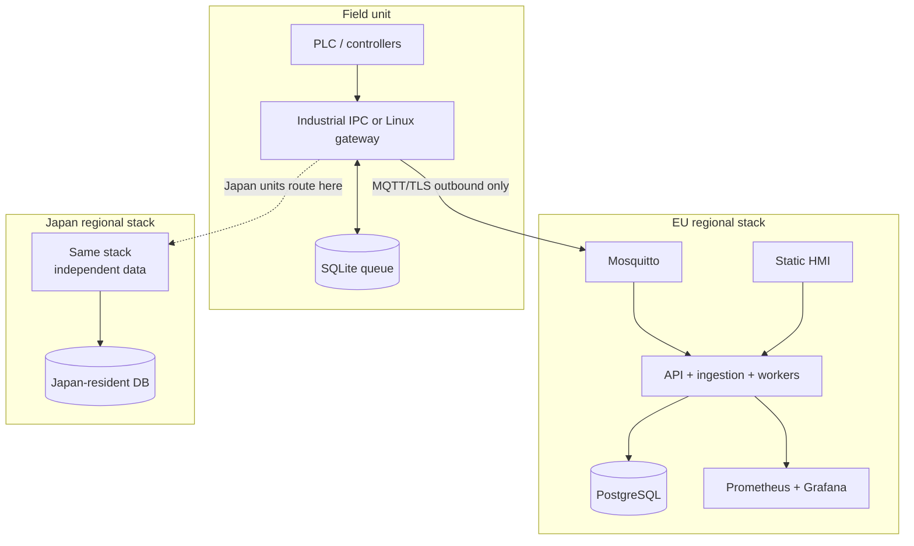

# Alpha SCADA Lightweight Open-Source SCADA Plan

Status: review draft  
Date: 2026-05-25  
Intent: architecture and implementation plan only. No implementation should start until Alpha reviews the decisions and open questions below.

Roadmap note: treat this as the Complete Version target. Implement the simplified MVP first using [alpha-scada-mvp-to-complete-roadmap.md](/Users/kopfmann/Documents/scada/alpha-scada-mvp-to-complete-roadmap.md).

## 1. Read-In Summary

Inputs reviewed:

- Reference architecture document
- Reference package diagram
- Reference deployment diagram
- Reference SCADA MVP backlog workbook

Important finding: the workbook summary says approximately `333-589 PD`, but the detailed MVP backlog and rollup sum to `344-604 PD` across 33 stories. The implementation plan below uses the detailed rollup and treats the discrepancy as an estimating item to reconcile before commercial commitment.

## 2. Architecture Position

Build a lightweight, open-source-first SCADA platform by composing proven infrastructure and writing only the Alpha-specific pieces: edge acquisition, Sparkplug ingestion, asset/tag model, alarm logic, operator UI, reports, and one PdM baseline.

Recommended field-side choice for MVP: **Option B, IPC/gateway-based edge agent**.

Rationale:

- The backlog already assumes an Combined Heat and Power Unit IPC edge agent, S7/Modbus drivers, local buffering, Sparkplug B publishing, and per-unit identity.
- It gives robust store-and-forward during cellular outages.
- It avoids PLC code changes for every platform iteration.
- It preserves a read-only cloud/control boundary for MVP safety.

Keep PLC-direct publishing as a fallback only if discovery proves there is no Linux-capable device in the cabinet and adding one is not economically viable.

## 3. Open-Source Stack

| Layer | MVP choice | Notes |
|---|---|---|
| Edge runtime | Go single binary | Linux x86_64 and ARM64, systemd, config hot reload, local health endpoint. |
| Field protocols | OPC UA / Modbus TCP first, S7 if confirmed | The workbook assumes Siemens S7-1500, but the Combined Heat and Power Unit data sheet and public pages do not confirm PLC vendor. Comparable systems commonly expose PLC/industrial-PC control layers, so the MVP should keep S7 as a driver plugin rather than a hard architectural bet until discovery confirms it. |
| Edge buffer | SQLite WAL | FIFO queue for telemetry during cloud/network outage. |
| Northbound protocol | MQTT + Sparkplug B 3.0 payload semantics | State-aware industrial MQTT with birth/data/death messages. |
| MQTT broker | Eclipse Mosquitto for strict OSS MVP | EMQX has stronger Sparkplug tooling, but current EMQX licensing should be reviewed if "open source" is a hard requirement. VerneMQ is the clustering alternative. |
| Ingestion/API | ASP.NET Core modular service on .NET 10 LTS | Start as a modular monolith to reduce operational overhead; split later only when load or ownership requires it. Strong fit for enterprise/customer-facing backend development. |
| Historian | PostgreSQL with partitioned telemetry tables; optional TimescaleDB Apache edition | Avoid depending on Timescale community/source-available features unless license review approves them. |
| Metadata/config DB | PostgreSQL | Tenants, users, roles, asset templates, tags, alarms, reports, audit log. |
| Frontend | React + Vite static SPA | Smaller than SSR for this use case; can still move to Next.js if Alpha prefers the original document recommendation. |
| Realtime UI | WebSocket from API | Push live tag values and alarms to the browser. |
| Auth | App-local users + one OIDC provider | Matches MVP backlog. Keycloak optional only if Alpha wants self-hosted IAM instead of direct OIDC integration. |
| Observability | Prometheus metrics + Grafana dashboards | Basic alerting in MVP. Loki/log aggregation and formal SLOs wait until Phase 1.5. |
| Deployment | Docker Compose for dev/demo; k3s profile for production-like single-node regional stacks | Same containers in both profiles. EU and Japan are independent deployments. |
| Reports | HTML-to-PDF worker | One branded monthly energy-production report. |
| PdM | Python worker for one engine anomaly baseline | Batch feature extraction from historian; shadow-mode alerts first. |

## 4. Logical Architecture



## 5. Runtime Components

### Edge Agent

Responsibilities:

- Load local unit config: unit ID, tenant ID, PLC endpoints, tag map, sampling interval, broker endpoint, credentials.
- Read PLC/controller data through OPC UA, Modbus TCP, or confirmed vendor-specific drivers.
- Normalize values into typed tag samples with quality and timestamps.
- Publish Sparkplug B birth/data/death messages.
- Persist unsent telemetry in SQLite and replay FIFO after reconnect.
- Expose `/health`, `/metrics`, and a small local diagnostics CLI.

MVP exclusions:

- No local HMI fallback.
- No OTA update system.
- No Modbus RTU.
- No cloud-to-device control writes.

### Broker And Ingestion

Responsibilities:

- Broker accepts only authenticated unit connections over TLS.
- Topic ACLs restrict each unit to its tenant/group namespace.
- Ingestion service decodes Sparkplug payloads, resolves metric names, validates tags against the asset model, writes current state, and appends historian rows.
- A disk-backed cloud queue protects telemetry if PostgreSQL is unavailable.

Decision point: if Alpha accepts source-available infrastructure, EMQX can replace Mosquitto for richer Sparkplug processing. If strict OSI-style open source matters, use Mosquitto and keep Sparkplug state handling in our ingestion service.

### Data Model

Core tables:

- `tenants`, `tenant_regions`, `users`, `roles`, `user_roles`
- `sites`, `units`, `asset_templates`, `asset_instances`
- `tags`, `tag_sources`, `tag_current`
- `telemetry_samples_<partition>`
- `alarm_definitions`, `alarm_events`, `notification_targets`
- `audit_events`
- `report_runs`
- `model_runs`, `anomaly_scores`
- `fuel_lots`, `fuel_quality_checks`, `biochar_lots`
- `maintenance_events`, `support_tickets`
- `emission_samples`, `energy_balances`

Isolation:

- Every tenant-owned row has `tenant_id`.
- API enforces tenant scope.
- PostgreSQL row-level security is recommended for defense in depth.
- Alpha support access is cross-tenant but audited.

Telemetry schema:

```sql
telemetry_samples (
  tenant_id uuid not null,
  unit_id uuid not null,
  tag_id uuid not null,
  ts timestamptz not null,
  value_double double precision,
  value_text text,
  value_bool boolean,
  quality text not null,
  source_ts timestamptz,
  received_ts timestamptz not null,
  primary key (tenant_id, tag_id, ts)
)
```

Partition by time first, and by tenant/unit only if measured load demands it.

### Operator UI

MVP screens:

- Login and tenant selection.
- Fleet view with unit status, last seen, alarm summary, production summary.
- Site view for one or more Combined Heat and Power Unit units plus optional BESS / material-handling equipment.
- Combined Heat and Power Unit unit overview with engine, gasifier, gas-cleaning, heat-recovery, biochar, and safety groups.
- Trend explorer with range, downsample, and CSV export.
- Active alarm console.
- Basic tag browser.
- Audit/config event view.
- Fuel, biochar, maintenance, and support-ticket summaries.
- Monthly report run/download view.

Reusable primitives only where actually reused:

- KPI tile.
- Status indicator.
- Alarm row.
- Trend chart.

Japanese localisation is demo-scope: visible MVP screens and JIS formatting conventions only.

## 6. Deployment Topology



MVP:

- Single-node per region.
- No regional bridging.
- No active-active.
- Daily PostgreSQL backups.
- Manual restore runbook.

Phase 1.5:

- HA broker/database profile.
- Automated edge update path.
- Full log aggregation.

## 7. Security And Safety

MVP security baseline:

- Outbound-only device connectivity.
- TLS on all external traffic.
- Per-unit credential issued manually at commissioning.
- Local users with Argon2id password hashes.
- One configurable OIDC provider.
- Fixed RBAC roles: Admin, Operator, Viewer.
- Audit log for auth and config events.
- Tenant-scoped API and database access.

Safety boundary:

- MVP is read-only from cloud to field.
- No remote setpoints, commands, firmware changes, or predictive control.
- Safety tags such as negative pressure, CO, and fire suppression are monitored and alarmed, but not controlled.

## 8. Implementation Plan

### Phase 0: Discovery And Acceptance Baseline, 1-2 weeks

Deliverables:

- Confirm PLC platform, exposed protocol, tag count, sample rates, target fleet, network uplink, regions, Japan demo scope, and OIDC provider.
- Decide strict open-source policy: OSI-only vs source-available allowed.
- Freeze MVP acceptance criteria and reconcile the backlog estimate discrepancy.
- Produce canonical Combined Heat and Power Unit tag map and safety tag list.

Exit gate:

- Alpha approves Option B edge architecture or explicitly chooses PLC-direct fallback.

### Phase 1: Platform Spine, 3-4 weeks

Stories: MVP-001, MVP-002, MVP-010, MVP-015, MVP-032 partial, MVP-033 partial.

Deliverables:

- Repo structure, containers, Docker Compose stack, k3s deployment profile.
- PostgreSQL schema migrations.
- Mosquitto TLS broker with per-unit auth and ACLs.
- Ingestion service skeleton with `/health` and `/metrics`.
- Cloud disk queue and historian write path.
- Basic CI: test, lint, image build, migration check.

Demo:

- Simulated unit publishes samples and data lands in historian.

### Phase 2: Edge Agent And Device Connectivity, 5-6 weeks

Stories: MVP-006, MVP-007, MVP-011, MVP-012, MVP-013, MVP-014, MVP-034 partial. Replace MVP-006 with an OPC UA or vendor-specific driver story if discovery disproves Siemens S7.

Deliverables:

- Go edge agent with config, systemd unit, metrics, local diagnostics.
- OPC UA/Modbus TCP driver path, with Siemens S7 implemented only if the Combined Heat and Power Unit controller actually requires it.
- Sparkplug B publisher with birth/data/death behavior.
- SQLite store-and-forward with replay.
- Unit identity and TLS material handling.
- 20-unit simulator/load harness.

Demo:

- One CHP-like unit or simulator streams 500 tags at 1Hz through outage/reconnect.

### Phase 3: Core Domain Model And Security, 4-5 weeks

Stories: MVP-003, MVP-004, MVP-005, MVP-008, MVP-009, MVP-028.

Deliverables:

- Tenant model and tenant-scoped APIs.
- Local login, one OIDC integration, session handling.
- Fixed RBAC roles.
- Append-only audit events for auth and config.
- Combined Heat and Power Unit asset template and tag tree instantiation.
- Tag current-state API and tag browser API.

Demo:

- Alpha tenant and one customer tenant see isolated units and tags.

### Phase 4: Operator HMI, 4-5 weeks

Stories: MVP-016, MVP-017, MVP-018, MVP-019, MVP-020, MVP-021, MVP-022.

Deliverables:

- React/Vite HMI shell.
- Fleet view, Combined Heat and Power Unit overview, trend explorer, tag browser.
- WebSocket real-time updates.
- Shared primitives: KPI tile, status indicator, alarm row, trend chart.
- Japanese localisation for demo-visible screens.

Demo:

- Operator can monitor live Combined Heat and Power Unit status, inspect trends, and use Japanese UI on demo screens.

### Phase 5: Alarms, Safety, Reporting, PdM, 5-6 weeks

Stories: MVP-023, MVP-024, MVP-025, MVP-026, MVP-027, MVP-031.

Deliverables:

- Threshold alarm definitions and evaluation worker.
- Active alarm console.
- Email notifications via SMTP.
- Safety monitoring for negative pressure, CO, fire suppression tags.
- Monthly energy production PDF report.
- One engine anomaly-detection baseline in shadow mode.

Demo:

- Alarm fires from simulated or live condition, email is sent, alarm appears in console, report can be generated, anomaly score is visible without controlling equipment.

### Phase 6: Regional Packaging And Hardening, 3-4 weeks

Stories: MVP-029, MVP-032 remainder, MVP-033 remainder, MVP-034 remainder.

Deliverables:

- EU and Japan deployment configs.
- Backups and restore runbook.
- Basic observability dashboards and alerts.
- 20-unit load test evidence.
- Security review checklist.
- Operator/admin runbooks.

Demo:

- Repeatable deployment of one regional stack and documented path to deploy the second.

## 9. Staffing Shape

Recommended 6-8 FTE MVP team:

- 1 tech lead/architect.
- 1 edge/OT engineer.
- 1 backend/platform engineer.
- 1 frontend engineer.
- 1 DevOps/cloud engineer.
- 1 QA/automation engineer.
- Optional part-time: UX designer, data scientist, Japanese localisation reviewer, security reviewer.

Calendar expectation remains 5-6 months, assuming discovery does not add PLC/platform surprises.

## 10. Explicit MVP Non-Goals

- High availability and active-active regional failover.
- Cloud-side writes/control.
- Predictive control.
- OTA update system.
- Full PKI automation and cert rotation.
- Modbus RTU.
- OPC UA server or DCS interop.
- Drag-and-drop screen designer.
- Full white-label theming.
- Formal IEC 62443 / ISO 27001 certification.
- CMMS, ERP, market, carbon registry, and BI integrations.
- More than one PdM model.
- More than one report template.

## 11. Review Questions

1. Is "open source" a strict OSI-license requirement, or are source-available components acceptable if free to self-host?
2. Is Option B edge hardware already present in the Combined Heat and Power Unit cabinet, or must it be added?
3. Which controller/protocol is actually exposed by the Combined Heat and Power Unit: OPC UA, Modbus TCP, Siemens S7, Beckhoff ADS/TwinCAT, Schneider/Modicon, or something else?
4. Should MVP use Docker Compose only, or do we want k3s as the production-like target from day one?
5. Is the first demo region EU, Japan, or both?
6. Which OIDC provider should be used for MVP?
7. What are the exact safety tags and alarm thresholds for negative pressure, CO, and fire suppression?
8. Which engine vitals are available for the anomaly baseline, and is there any labelled historical data?
9. Is Japanese localisation required for all MVP screens, or only the customer-facing demo path?
10. Which estimate should become the commercial baseline: workbook summary `333-589 PD` or detailed rollup `344-604 PD`?
11. Should the MVP include fuel-lot, biochar-lot, and carbon-credit evidence capture, or only leave the schema ready for Phase 1.5?
12. Is BESS part of the first customer demo, or should it remain an optional asset type?

## 12. Source Notes

External checks used only to validate current open-source component posture:

- [Eclipse Mosquitto](https://mosquitto.org/) is documented as an EPL/EDL open-source MQTT broker supporting MQTT 5.0, 3.1.1, and 3.1.
- [Eclipse Sparkplug](https://sparkplug.eclipse.org/about/faq/) defines MQTT usage for real-time industrial infrastructure and can be implemented without fee or royalty under Eclipse terms.
- [k3s](https://docs.k3s.io/) remains a lightweight Kubernetes distribution packaged as a small single binary.
- [PostgreSQL](https://www.postgresql.org/about/licence/) uses the PostgreSQL open-source license.
- [TimescaleDB editions](https://docs.timescale.com/about/latest/timescaledb-editions/) distinguish the Apache 2 edition from the more feature-complete Timescale License community edition, so feature/license selection needs review.
- [EMQX](https://github.com/emqx/emqx) shifted current self-hosted releases to BSL 1.1 from v5.9.0, so it should be treated as source-available unless license review says otherwise.
- [Grafana licensing](https://grafana.com/licensing/) lists core open-source projects under AGPLv3.
- [Keycloak](https://www.keycloak.org/) is open-source IAM and supports OIDC/SAML identity federation.

## 13. Combined Heat and Power Unit Research Addendum

This addendum was added after reviewing the local Combined Heat and Power Unit data sheet and researching Alpha plus comparable biomass CHP / biogas operators online.

### What The Combined Heat and Power Unit Is Like

The Combined Heat and Power Unit should be treated as a compact industrial wood-gas CHP asset, not merely a generic telemetry device.

Relevant local data sheet facts:

- 55-60 kW nominal electrical output and 138 kW thermal output, dependent on wood-chip quality and moisture.
- Approximately 55 kg/h wood-chip consumption, around 1.32 t/day.
- Biochar output is roughly 5-10% of wood chips used, around 0.4-0.8 m3/day.
- Hot-water loop operates around 80-95°C supply and 45-65°C return at 4.5-7 bar.
- Startup requires about 40 kW grid draw.
- The installation needs internet connectivity, WiFi or minimum 4G.
- The unit needs dry compressed air, room ventilation, ambient-temperature limits, and substantial floor/forklift/site preparation.
- Safety architecture includes negative pressure operation, mandatory CO detectors around the unit, and a fire-suppression tank flushing the feed line in flashback/backfire events.
- Support is sold as ticket-based optional packages.

Public Alpha positioning adds more product context:

- Reference CHP vendors present Combined Heat and Power Unit as continuous, modular, 24/7 energy production for industrial/agricultural sites with dry biomass waste.
- BESS pairing is central to the message: peak shaving, overnight storage, island/blackout resilience, and better fit for sites that do not run 24/7.
- The commercial value proposition is not only SCADA visibility; it is energy independence, predictable cost, biochar/carbon-credit upside, and multi-unit availability.

### Comparable Market Pattern

Comparable wood-gas CHP vendors cluster around 40-60 kW electric units:

- Fröling CHP: 46/50/56 kW electric, 95/105/115 kW thermal, containerized plug-and-play gasifier package.
- Volter 40: 40 kW electric and 100 kW hot-water heat, with internet/GSM remote control.
- LiPRO HKW50: 50 kW electric and 97 kW thermal, with remote monitoring, alarm functions, industrial PC/PLC control, flare handling, and 24/7 operation claims.
- BE&E / Glock-style CHP: 57 kW electric, 120 kW thermal, serial multi-system operation, biochar uses, modern control, simple service.

Common buyer needs:

- Prove uptime and full-load hours.
- Keep the unit running with low downtime, fast remote diagnosis, and spare-parts/service workflows.
- Track fuel quality, moisture, particle size, contamination, and inventory because fuel quality directly affects gasifier stability, power output, tar/ash, and maintenance.
- Use the heat, not just the electricity; wasted thermal output damages ROI.
- Document safety, emissions, and audit evidence.
- Quantify energy savings, avoided fuel cost, avoided grid draw, export revenue, and biochar/carbon value.

Biogas/anaerobic-digester operators show a related but different pattern:

- Their process monitoring is biological: feedstock composition, loading rate, pH, temperature, alkalinity/VFA, methane, CO2, H2S, and biological stability.
- If the platform expands into bioreactors/biogas later, that should be a separate asset template. It should not distort the Combined Heat and Power Unit MVP unless a bioreactor customer is actually in scope.

### Plan Adjustments Required

1. Change the product model from `unit-first` to `site-first`.

   A real customer site may have multiple Combined Heat and Power Unit units, a BESS, conveyors, moving floors, wood-chip storage, dryer/pre-dryer, hot-water loop, grid connection, and optional biochar handling. The plan now includes `sites` as a first-class entity.

2. Promote fuel quality and fuel inventory into MVP or near-MVP.

   The original plan only had tags/historian. Combined Heat and Power Unit performance depends heavily on wood-chip moisture and quality. Add fuel lots, moisture checks, supplier/source, delivery notes, storage level, and fuel-consumption KPIs.

3. Add biochar lot tracking and MRV readiness.

   A monthly energy report is too narrow if Alpha sells biochar/carbon-credit upside. Add biochar lots, production volume/mass, disposal/use destination, feedstock linkage, and exportable evidence. Full carbon-credit workflow can wait, but the data model should not be retrofitted later.

4. Add maintenance and support workflows earlier.

   The PDF says support is ticket-based, and competitors emphasize remote service. Add operating hours, engine oil consumption/refill status, filter/service intervals, downtime reason codes, remote diagnostic snapshots, and support tickets.

5. Expand the Combined Heat and Power Unit template.

   Replace the generic Combined Heat and Power Unit groups with: fuel receiving/storage, dryer/pre-dryer, conveyor/feed system, gasifier, gas filtering/cleaning, flare/start-stop handling, engine/genset, heat recovery/hot-water loop, exhaust/after-treatment, biochar discharge, compressed air, ventilation/ambient, safety, BESS optional, and grid interconnect.

6. Revisit the driver priority.

   Do not commit to Siemens S7 as the first driver until the equipment supplier confirms the controller. For a lightweight open-source SCADA, OPC UA + Modbus TCP should be the default integration path, with S7, Beckhoff ADS/TwinCAT, or Schneider-specific drivers added if the actual Combined Heat and Power Unit control stack requires them.

7. Add BESS and load-balancing as explicit optional modules.

   Keep MVP read-only by default, but model schedules, power limit, state of charge, island/blackout state, and peak-shaving KPIs. If demo requires cloud-side scheduling, treat that as a controlled Phase 1.5 decision with safety approvals.

8. Strengthen safety and emissions.

   Safety tags should not just be "surfaced"; they need a defined alarm matrix: negative pressure/vacuum, CO detector status, fire-suppression tank/valves, feed-line temperature/backfire, compressed-air pressure/dryer status, ventilation/ambient temperature, exhaust temperature, NOx/CO where available, flare status, emergency stop, and door/access interlocks if exposed.

9. Add business-owner dashboards.

   Operators need alarms and trends. Buyers also need ROI: kWh generated, heat used, heat wasted, fuel consumed, grid draw avoided, uptime/full-load hours, energy cost avoided, biochar produced, estimated CO2 sink, and BESS peak-shaving value.

10. Keep bioreactor support out of Combined Heat and Power Unit MVP unless explicitly needed.

   If "bioreactor" means anaerobic digestion/biogas, create a later `Biogas_AD` asset template with biological process monitoring. Do not mix pH/VFA/alkalinity logic into the Combined Heat and Power Unit wood-gas CHP template.
