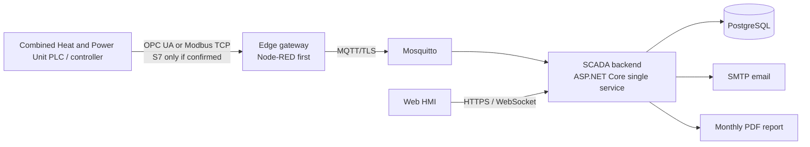

# Alpha Combined Heat and Power Unit Lightweight Open-Source SCADA: Simplified Plan

Status: simplified review draft  
Date: 2026-05-25  
Purpose: reduce the previous architecture to the smallest useful SCADA MVP for one Alpha Combined Heat and Power Unit demo unit, while leaving a path to grow later.

Roadmap link: use this as Stage 1 in [alpha-scada-mvp-to-complete-roadmap.md](/Users/kopfmann/Documents/scada/alpha-scada-mvp-to-complete-roadmap.md).

## 1. Simplification Principle

Build the first version as a **single-unit monitoring and reporting system**, not a full IoT platform.

The previous plan was technically sound but too platform-shaped for an early MVP. This version cuts it down:

- One customer, one Combined Heat and Power Unit unit, one region.
- Monitoring first; no remote control.
- One edge gateway.
- One backend service.
- One database.
- One web HMI.
- One report.
- One deployment profile.

Anything not needed to prove the Combined Heat and Power Unit demo is deferred.

## 2. Simple Architecture



## 3. Recommended MVP Stack

| Area | Simple choice | Why |
|---|---|---|
| Edge gateway | **Node-RED first**, Go agent later if needed | Fast to integrate OPC UA/Modbus/MQTT, easy for demos and field troubleshooting. |
| PLC protocols | **OPC UA or Modbus TCP first** | Do not assume Siemens S7 until the equipment supplier confirms it. |
| Broker | **Mosquitto** | Small, open source, simple MQTT broker. |
| Backend | **One ASP.NET Core service on .NET 10 LTS** | Handles ingestion, API, alarms, realtime updates, reports. Fits enterprise/customer expectations and keeps the MVP as one deployable service. |
| Database | **PostgreSQL only** | Store config, current values, history, alarms, audit, reports in one DB. Skip TimescaleDB at MVP. |
| Frontend | **React + Vite** | Simple static HMI. |
| Deployment | **Docker Compose** | One VM or industrial PC/cloud VM. k3s can wait. |
| Observability | **Container logs + basic `/health` + Prometheus metrics if cheap** | No Grafana/Loki/SLO stack unless operations demand it. |
| Auth | **Local users only for demo** | OIDC can wait unless the first customer requires SSO. |

## 4. Data Model

Keep the model intentionally small:

```text
tenant
  unit
    subsystem
      tag
```

Use `site` only as an optional label:

```text
tenant.site_name = "Example Production Site"
```

Do not build a full site hierarchy yet. If the first customer has multiple units or BESS, add `sites` later.

Core tables:

- `users`
- `units`
- `subsystems`
- `tags`
- `tag_current`
- `telemetry_samples`
- `alarm_rules`
- `alarm_events`
- `report_runs`
- `audit_events`

Optional simple tables:

- `operator_notes`
- `maintenance_notes`
- `fuel_checks`
- `biochar_entries`

Those optional tables can be basic forms, not full workflows.

## 5. Combined Heat and Power Unit Subsystems For MVP

Model only the subsystems visible in the Combined Heat and Power Unit data sheet and useful for demo:

- Fuel feed.
- Gasifier.
- Gas cleaning / filtering.
- Engine / generator.
- Heat recovery / hot-water loop.
- Biochar output.
- Exhaust / emissions.
- Compressed air.
- Ventilation / ambient.
- Safety.

Safety tags should include, if available:

- Negative pressure / vacuum.
- CO detector status.
- Fire suppression tank / valve status.
- Feed-line overtemperature or flashback signal.
- Emergency stop.
- Exhaust temperature.
- Compressed-air pressure.

## 6. MVP Screens

Build only these screens:

1. Login.
2. Combined Heat and Power Unit overview.
3. Live tag list.
4. Trends.
5. Active alarms.
6. Monthly report.
7. Simple admin/config screen.

The Combined Heat and Power Unit overview should show:

- Electrical output.
- Thermal output.
- Total efficiency estimate.
- Wood-chip consumption estimate.
- Biochar estimate.
- Engine state.
- Hot-water supply/return temperature.
- Alarm status.
- Last communication time.
- Safety status.

## 7. Alarm Scope

Start with threshold alarms only:

- High/low value.
- Communication lost.
- Bad quality.
- Safety fault.

Email notification only.

No alarm shelving, routing pipelines, on-call rosters, Slack, SMS, escalation chains, or ISA-18.2 workflow in MVP.

## 8. Reporting Scope

One monthly PDF:

- kWh generated.
- Estimated heat delivered.
- Runtime hours.
- Availability.
- Wood chips consumed.
- Estimated biochar produced.
- Alarm count.
- Top downtime reasons, if operator notes exist.

Do not build a report designer.

## 9. What To Cut From MVP

Cut or defer:

- k3s/Kubernetes.
- Multi-region deployment.
- OIDC/SSO.
- Full multi-tenancy.
- TimescaleDB.
- Sparkplug B strict compliance.
- EMQX.
- Separate ingestion, alarm, reporting, analytics services.
- BESS modeling.
- Full site model.
- Ticketing system.
- Fuel-lot inventory workflow.
- Biochar/carbon-credit MRV workflow.
- Predictive maintenance model.
- Remote control / setpoints.
- OTA updates.
- Formal IEC 62443 / ISO 27001 evidence pack.
- Japanese localisation beyond demo labels, unless required for the meeting.

## 10. Implementation Phases

### Phase 0: Confirm Combined Heat and Power Unit Interface, 2-3 days

Confirm:

- Controller type.
- Protocol: OPC UA, Modbus TCP, S7, or other.
- Tag list.
- Sampling rates.
- Available safety signals.
- Whether a Linux gateway already exists.

Exit gate:

- We can read live or simulated Combined Heat and Power Unit tags.

### Phase 1: Running Skeleton, 1-2 weeks

Deliver:

- Docker Compose stack.
- Mosquitto.
- PostgreSQL.
- Backend service.
- Basic web HMI shell.
- Simulated Combined Heat and Power Unit publisher.

Demo:

- Fake Combined Heat and Power Unit data appears live in the browser.

### Phase 2: Real Data Path, 2-3 weeks

Deliver:

- Node-RED or edge agent reads real/simulated PLC data.
- MQTT publish to broker.
- Backend stores current values and history.
- Communication-lost detection.

Demo:

- Real Combined Heat and Power Unit tags trend in the HMI.

### Phase 3: Operator MVP, 2-3 weeks

Deliver:

- Combined Heat and Power Unit overview screen.
- Live tag list.
- Trend screen.
- Active alarms.
- Email alerts.

Demo:

- Operator can monitor the Combined Heat and Power Unit and receive alarms.

### Phase 4: Report And Demo Polish, 1-2 weeks

Deliver:

- Monthly PDF report.
- Basic admin config.
- Demo labels / Japanese labels if needed.
- Backup/restore notes.

Demo:

- End-to-end customer demo with live data, alarms, trends, and report.

## 11. Estimated Shape

This simplified MVP is closer to:

- 6-10 weeks.
- 3-4 people.
- Roughly 80-160 person-days.

Suggested team:

- 1 full-stack/backend lead.
- 1 edge/OT engineer.
- 1 frontend engineer.
- 0.5 QA/DevOps.

## 12. Growth Path

Only after the simple MVP works:

1. Add proper `sites` if there are multiple units or BESS.
2. Replace Node-RED with a hardened edge agent if field deployment needs it.
3. Add OIDC and tenant isolation for paying customers.
4. Add TimescaleDB if PostgreSQL history queries become slow.
5. Add fuel lots, biochar MRV, maintenance tickets, and BESS workflows.
6. Add Kubernetes/HA only when uptime SLA requires it.

## 13. Decision I Recommend

For the first Alpha demo, use:

```text
Node-RED edge gateway
Mosquitto
one ASP.NET Core backend
PostgreSQL
React/Vite HMI
Docker Compose
```

That is enough to prove the value: live Combined Heat and Power Unit monitoring, alarms, trends, and a monthly report.
