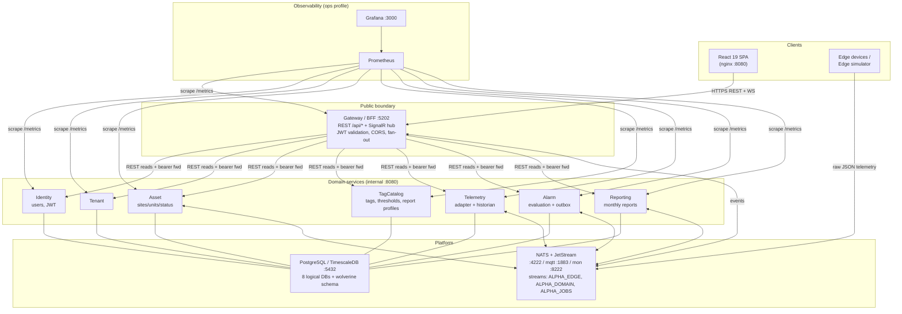
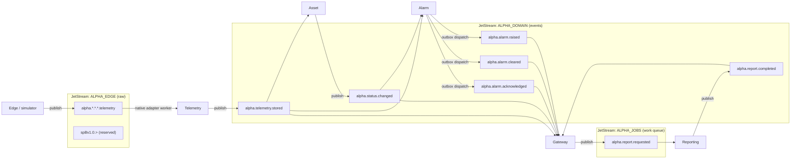
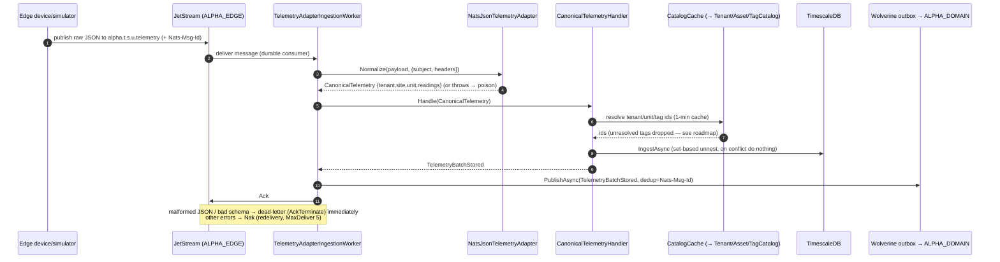
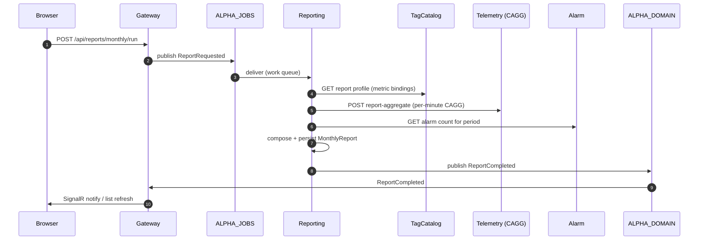
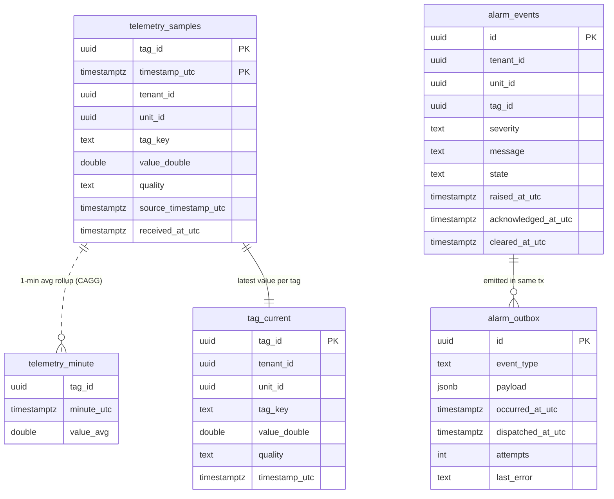
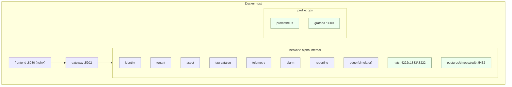

# Alpha SCADA — Architecture Diagrams (by Claude)

> _Authored by Claude (Opus 4.8) on 2026-06-05 (codebase @ `fc21040`)._
> _Companion to [`ARCHITECTURE-by-Claude.md`](ARCHITECTURE-by-Claude.md). GitHub renders the Mermaid blocks below._
> _For a first-pass stakeholder view, use [`architecture-diagram-by-Claude-simple.md`](architecture-diagram-by-Claude-simple.md)._

---

## 1. System context & components



---

## 2. Messaging topology (who publishes / who listens)



---

## 3. Telemetry ingestion (anti-corruption boundary) — sequence



---

## 4. Alarm lifecycle with guaranteed delivery (transactional outbox)

```mermaid
sequenceDiagram
    autonumber
    participant Bus as ALPHA_DOMAIN (telemetry.stored)
    participant AH as TelemetryStoredAlarmHandler
    participant Svc as AlarmService
    participant DB as alpha_alarm DB
    participant Disp as AlarmOutboxDispatcher
    participant Out as Wolverine → ALPHA_DOMAIN
    participant GW as Gateway (SignalR)

    Bus->>AH: TelemetryBatchStored
    AH->>Svc: EvaluateAsync(samples)
    Svc->>DB: BEGIN; insert alarm_events (RETURNING) + insert alarm_outbox; COMMIT
    Note over Svc,DB: state change and event row committed atomically
    Svc-->>AH: events
    AH->>Disp: Kick() (opportunistic)
    Disp->>DB: SELECT ... FOR UPDATE SKIP LOCKED (pending, attempts < max)
    Disp->>Out: PublishAsync(AlarmRaised/Cleared, dedup id)
    Disp->>DB: mark dispatched
    Out->>GW: AlarmRaised/Cleared
    GW->>GW: broadcast to tenant SignalR group
    Note over Disp: 1s sweeper recovers anything missed by a crash
```

---

## 5. Monthly reporting (async job)



---

## 6. Telemetry & alarm data model (TimescaleDB)



> `telemetry_samples` is a hypertable (1-day chunks, compress >7d, retention 365d). `alarm_events` has a partial unique index on `tag_id WHERE state IN ('active','acknowledged')` enforcing one active alarm per tag.

---

## 7. Deployment (local Docker Compose)



> Only `frontend (8080)` and `gateway (5202)` (plus `grafana 3000` under the ops profile) expose host ports; everything else is reachable only on `alpha-internal`. In k3s (`ops/k3s/`) the same topology runs as Deployments/StatefulSets with NATS and Postgres as cluster services.
