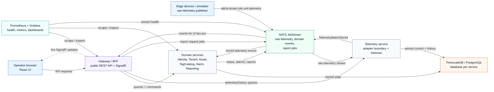

# Alpha SCADA Simplified Architecture Diagram Notes

> Companion to [`architecture-review.md`](architecture-review.md) and the detailed diagram set in [`architecture-diagram-notes.md`](architecture-diagram-notes.md).
> This version keeps only the major runtime responsibilities and is intended for stakeholder review.

## How To Read It

- **Gateway** is the public backend boundary. The browser never calls internal services directly.
- **Telemetry** is the protocol normalization boundary. Raw edge payloads become canonical telemetry before other services see them.
- **NATS JetStream** carries raw telemetry, normalized domain events, and asynchronous report jobs.
- **TimescaleDB/PostgreSQL** remains the system of record. NATS is the durable transport, not the historian.
- **Domain services** own their own data and react to normalized events instead of parsing edge payloads.
