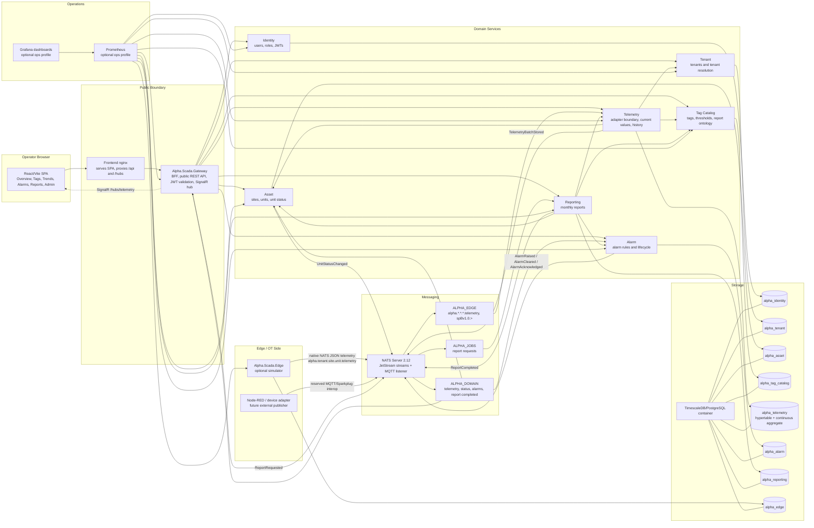
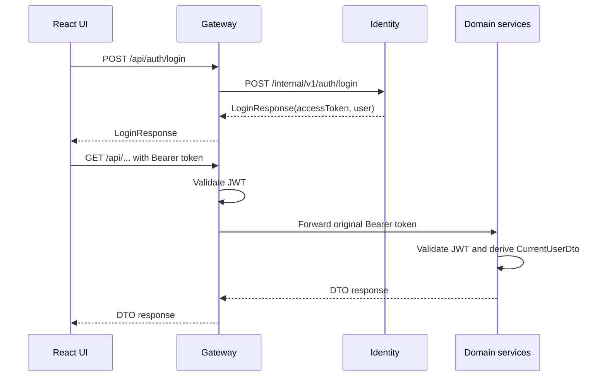
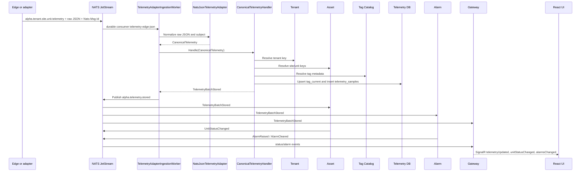
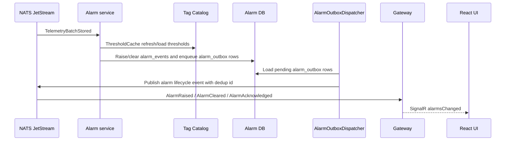
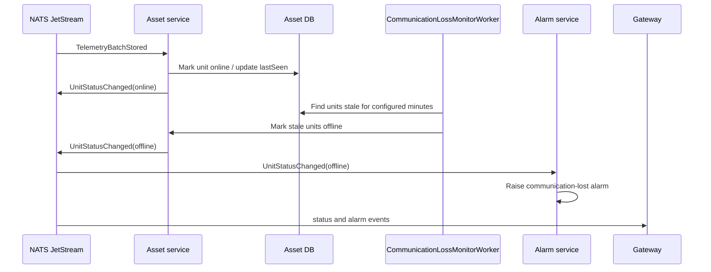
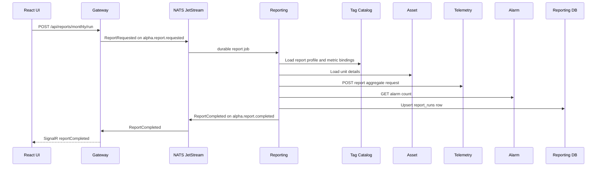

# Alpha SCADA System Overview

Last reviewed: 2026-06-05.

This document describes the current Alpha SCADA codebase after the microservices, NATS/Wolverine, TimescaleDB, report-ontology, frontend split, and telemetry adapter refactors. It is intended for engineers, solution architects, delivery leads, and operators who need to understand what the system does, how the services fit together, and where code changes should be made.

Related documents:

- [ADR 002: Wolverine Messaging Over NATS JetStream](architecture-decisions/002-messaging.md)
- [Messaging runbook](messaging-runbook.md)
- [Developer setup](dev-setup.md)
- [Simplified Mermaid architecture diagram](architecture-diagram-simple.mmd)
- [Detailed Mermaid architecture diagram](architecture-diagram.mmd)
- [Sparkplug B integration task](tasks/sparkplug-b-integration.md)

## Executive Summary

Alpha SCADA is a lightweight open-source SCADA platform for small industrial energy sites. The current system provides:

- tenant, site, and unit inventory;
- live tag telemetry and current values;
- historical trends backed by TimescaleDB;
- threshold, quality, and communication-loss alarms;
- monthly operational reports;
- browser-based operational screens;
- NATS JetStream based ingestion, events, and jobs;
- Docker Compose for local development and k3s manifests for production-like pilot deployments.

The backend is split into one public Gateway/BFF and eight domain services:

1. Gateway
2. Identity
3. Tenant
4. Asset
5. Tag Catalog
6. Telemetry
7. Alarm
8. Reporting
9. Edge

The "eight domain services plus Gateway" language counts Edge as the edge/domain adapter service and treats Gateway as the public boundary rather than a domain service.

## Design Principles

The current architecture is guided by these principles:

- **Gateway as the only public backend API.** The React app calls Gateway only. Internal services expose `/internal/v1/...` routes for Gateway or service-to-service use.
- **Telemetry as the normalization boundary.** Raw edge payloads are parsed only by Telemetry. Downstream services consume domain events such as `TelemetryBatchStored`.
- **Service-owned data.** Each service owns its logical database. Cross-service reads use HTTP APIs; cross-service events/jobs use NATS/Wolverine.
- **Raw Npgsql, not EF Core.** Repositories use explicit SQL and Npgsql to keep storage behavior and batch writes visible.
- **NATS for broker durability.** NATS JetStream owns durable streams and work queues. PostgreSQL remains business storage and Wolverine persistence/error metadata, not the main broker.
- **Wolverine as the .NET domain messaging layer.** Domain events and report jobs use Wolverine handlers, durable inbox/outbox policies, retry/error policy, and NATS transport conventions through `ServiceDefaults`. Raw edge payloads are handled at the Telemetry adapter boundary before they become domain events.
- **Small, explicit services.** The services are intentionally simple; each `Program.cs` wires dependencies, migrations, auth, messaging, operations endpoints, and minimal APIs.
- **Operational UI first.** The frontend is a dense monitoring UI, not a marketing site.

## Architecture Diagram



For copy-paste Mermaid code, see the [simplified diagram](architecture-diagram-simple.mmd) or the [detailed diagram](architecture-diagram.mmd).

## Runtime Containers And Exposure

Local Docker Compose starts these containers:

| Container | Public host port | Internal port | Purpose |
| --- | ---: | ---: | --- |
| `frontend` | `8080` | `80` | nginx serving the React build and proxying `/api`, `/hubs`, `/health`, `/ready`, `/metrics` to Gateway |
| `gateway` | `5202` | `8080` | public API/BFF and SignalR hub |
| `identity` | not exposed | `8080` | users, auth, JWT issuing |
| `tenant` | not exposed | `8080` | tenant records |
| `asset` | not exposed | `8080` | sites, units, online/offline state |
| `tag-catalog` | not exposed | `8080` | tags, thresholds, report config |
| `telemetry` | not exposed | `8080` | raw telemetry adapter, current values, TimescaleDB history |
| `alarm` | not exposed | `8080` | alarm lifecycle |
| `reporting` | not exposed | `8080` | monthly report generation |
| `edge` | not exposed | `8080` | optional simulator |
| `postgres` | not exposed | `5432` | TimescaleDB/PostgreSQL |
| `nats` | `4222`, `1883`, `8222` | same | NATS client, MQTT, monitoring ports |
| `prometheus` | not exposed by default | `9090` | optional metrics scraper |
| `grafana` | `3000` | `3000` | optional dashboards |

Only the UI, Gateway, NATS debug/ingress ports, and Grafana are published to the host in local Compose. Domain services and Postgres are only reachable on the `alpha-internal` Compose network.

## Technology Stack

| Layer | Technology | Notes |
| --- | --- | --- |
| Frontend | React 19, Vite 7, TypeScript, SignalR client | Screens are split by file under `src/Alpha.Scada.Web/src/screens` |
| Public backend | ASP.NET Core .NET 10 Minimal APIs | Gateway/BFF plus SignalR hub |
| Services | ASP.NET Core .NET 10 | Small web services with `Program.cs`, `Application`, `Domain`, `Infrastructure` |
| Messaging | NATS Server 2.12, JetStream | Durable edge stream, domain event stream, report job stream |
| .NET messaging | WolverineFx 5.21, WolverineFx.Nats, WolverineFx.Postgresql | Handler discovery, retry/error policy, durable inbox/outbox metadata |
| Database | TimescaleDB 2.17 on PostgreSQL 16 | One container in dev, separate logical DB per service |
| Data access | Npgsql 10 | Explicit SQL, set-based telemetry writes, no EF Core |
| Auth | JWT bearer, PBKDF2 password hashing | Local users first; OIDC is not wired |
| Observability | `/metrics`, Prometheus, Grafana | Optional ops profile in Compose |
| Deployment | Docker Compose, k3s YAML | Pilot-level, no HA clustering yet |

## Service Responsibilities

| Service | Project | Owns | Main code locations |
| --- | --- | --- | --- |
| Gateway | `src/Alpha.Scada.Gateway` | Public REST API compatibility, BFF orchestration, JWT validation, SignalR, NATS-to-browser realtime bridge, report request publishing | `Program.cs`, `Application/*BroadcastHandler.cs`, `Application/GatewayAuth.cs`, `Realtime/TelemetryHub.cs`, `MessagingTopology.cs` |
| Identity | `src/Alpha.Scada.Identity` | Users, roles, password hashes, login/logout audit, JWT issuing | `Application/AuthService.cs`, `Infrastructure/IdentityRepository.cs`, `Infrastructure/IdentityMigrator.cs`, `Infrastructure/PasswordHasher.cs` |
| Tenant | `src/Alpha.Scada.Tenant` | Tenant records, tenant list visibility, tenant-key resolution | `Application/TenantService.cs`, `Infrastructure/TenantRepository.cs`, `Infrastructure/TenantMigrator.cs` |
| Asset | `src/Alpha.Scada.Asset` | Sites, units, unit route keys, online/offline state, stale-unit monitor | `Application/AssetService.cs`, `Application/CommunicationLossMonitorWorker.cs`, `Application/TelemetryStoredStatusHandler.cs`, `Infrastructure/AssetRepository.cs` |
| Tag Catalog | `src/Alpha.Scada.TagCatalog` | Tag definitions, subsystems, engineering units, thresholds, report metric definitions, report profile and bindings | `Application/TagCatalogService.cs`, `Infrastructure/TagCatalogRepository.cs`, `Infrastructure/TagCatalogMigrator.cs` |
| Telemetry | `src/Alpha.Scada.Telemetry` | Native NATS JSON adapter boundary, canonical telemetry, tag resolution cache, current values, TimescaleDB history, report aggregates | `Application/TelemetryAdapterIngestionWorker.cs`, `Application/Messaging/*`, `Application/CanonicalTelemetryHandler.cs`, `Application/CatalogCache.cs`, `Infrastructure/TelemetryRepository.cs`, `Infrastructure/TelemetryMigrator.cs` |
| Alarm | `src/Alpha.Scada.Alarm` | Threshold and quality alarms, communication-loss alarm, active/ack/clear lifecycle, alarm counts, alarm event publishing | `Domain/AlarmRule.cs`, `Application/TelemetryStoredAlarmHandler.cs`, `Application/UnitStatusAlarmHandler.cs`, `Application/AlarmService.cs`, `Application/AlarmOutboxDispatcher.cs`, `Infrastructure/AlarmRepository.cs` |
| Reporting | `src/Alpha.Scada.Reporting` | Report job handling, monthly report orchestration, report run persistence | `Application/ReportRequestedHandler.cs`, `Application/ReportingService.cs`, `Infrastructure/ReportingRepository.cs` |
| Edge | `src/Alpha.Scada.Edge` | Optional simulator and edge publishing boundary | `Application/ChpUnitSimulatorWorker.cs`, `Infrastructure/EdgeMigrator.cs` |

Shared projects:

| Project | Purpose |
| --- | --- |
| `Alpha.Scada.Contracts` | REST/internal DTOs split into `Auth`, `Assets`, `Telemetry`, `Tags`, `Reports`, `Alarms`, `Tenants`, `Edge`, and `Messaging` folders |
| `Alpha.Scada.Telemetry.Contracts` | `TelemetryBatchStored` domain event |
| `Alpha.Scada.Asset.Contracts` | `UnitStatusChanged` domain event |
| `Alpha.Scada.Alarm.Contracts` | `AlarmRaised`, `AlarmCleared`, `AlarmAcknowledged` domain events |
| `Alpha.Scada.Reporting.Contracts` | `ReportRequested`, `ReportCompleted` job/event records |
| `Alpha.Scada.ServiceDefaults` | shared auth, service clients, resilience, migration runner, operational endpoints, metrics, Wolverine/NATS conventions |

## Clean Architecture Shape

Each domain service uses a lightweight Clean Architecture layout:

```text
Domain/          Business rules, domain records, value-oriented logic
Application/     Use cases, message handlers, caches/resolvers, hosted workers
Infrastructure/  Npgsql repositories, SQL migrators, persistence adapters
Program.cs       Composition root: DI, auth, messaging, endpoints, migrations
```

This is intentionally not a heavy framework. There are no controllers, no MediatR layer, no EF Core, and no separate API/Application/Infrastructure projects per service. That keeps the repository approachable, but still gives each service a clear internal dependency direction.

Gateway and Edge are exceptions:

- Gateway is a public boundary and orchestration service, so it is mostly `Program.cs`, small broadcast handlers, and `TelemetryHub`.
- Edge is currently simulator-focused, so it has a thin hosted worker and minimal service shell.

## Data Ownership

Local development uses one TimescaleDB/PostgreSQL container, but each service owns a separate logical database:

| Database | Owner | Important tables/views |
| --- | --- | --- |
| `alpha_identity` | Identity | `users`, `audit_events` |
| `alpha_tenant` | Tenant | `tenants` |
| `alpha_asset` | Asset | `sites`, `units` |
| `alpha_tag_catalog` | Tag Catalog | `tags`, `report_metric_definitions`, `report_profiles`, `report_metric_bindings` |
| `alpha_edge` | Edge | `edge_devices` |
| `alpha_telemetry` | Telemetry | `tag_current`, `telemetry_samples`, `telemetry_minute` |
| `alpha_alarm` | Alarm | `alarm_events`, `alarm_outbox` |
| `alpha_reporting` | Reporting and Gateway Wolverine metadata | `report_runs`, Wolverine persistence tables |

Rules:

- Services do not read each other's databases directly.
- Query-style cross-service access goes through HTTP internal APIs.
- Event/job style cross-service work goes through NATS/Wolverine.
- Service migrators run at startup and record service migrations in `alpha_schema_migrations`.
- Wolverine can create/update its own persistence schema at startup under the configured Wolverine schema.

### Telemetry Historian

Telemetry uses TimescaleDB:

- `telemetry_samples` stores time-series samples and is converted to a hypertable partitioned by `timestamp_utc`.
- `tag_current` stores the latest known value per tag.
- `telemetry_minute` is a continuous aggregate used by report queries.
- retention is configured by `Timescale:RetentionDays`, defaulting to 365 days;
- compression is applied after 7 days;
- writes are set-based through Npgsql arrays/`unnest`, not per-row loops.

## Public And Internal APIs

The browser calls Gateway only.

Public Gateway routes:

```text
POST /api/auth/login
POST /api/auth/logout
GET  /api/me
GET  /api/tenants
GET  /api/sites
GET  /api/sites/{siteId}/units
GET  /api/units/{unitId}
GET  /api/units/{unitId}/tags/current
GET  /api/tags/{tagId}/history?minutes=30
GET  /api/alarms/active
POST /api/alarms/{alarmId}/ack
GET  /api/reports/monthly
POST /api/reports/monthly/run
GET  /hubs/telemetry
GET  /health
GET  /ready
GET  /metrics
```

Internal examples:

```text
Identity:    POST /internal/v1/auth/login
Tenant:      GET  /internal/v1/tenants
Tenant:      GET  /internal/v1/tenants/resolve/{tenantKey}
Asset:       GET  /internal/v1/sites
Asset:       GET  /internal/v1/units/resolve
Asset:       GET  /internal/v1/units/{unitId}/route
TagCatalog:  GET  /internal/v1/units/{unitId}/tags
TagCatalog:  POST /internal/v1/tags/resolve
TagCatalog:  GET  /internal/v1/report-config/units/{unitId}?tenantId={tenantId}
Telemetry:   GET  /internal/v1/telemetry/units/{unitId}/current
Telemetry:   GET  /internal/v1/telemetry/tags/{tagId}/history
Telemetry:   POST /internal/v1/telemetry/units/{unitId}/report-aggregate
Alarm:       GET  /internal/v1/alarms/active
Alarm:       POST /internal/v1/alarms/{alarmId}/ack
Alarm:       GET  /internal/v1/alarms/count?unitId={unitId}&period=YYYY-MM
Reporting:   GET  /internal/v1/reports/monthly
```

Most user-facing internal routes require JWT authorization. A few lookup routes used by ingestion/reporting are intentionally unauthenticated in the current implementation because they are only exposed on the internal network.

## Messaging Model

NATS JetStream streams:

| Stream | Subjects | Purpose |
| --- | --- | --- |
| `ALPHA_EDGE` | `alpha.*.*.*.telemetry`, `spBv1.0.>` | raw edge ingress and Sparkplug-ready reserved ingress |
| `ALPHA_DOMAIN` | `alpha.telemetry.stored`, `alpha.status.changed`, `alpha.alarm.raised`, `alpha.alarm.cleared`, `alpha.alarm.acknowledged`, `alpha.report.completed` | normalized domain events with fan-out consumers |
| `ALPHA_JOBS` | `alpha.report.requested` | work-queue style report request jobs |

Important subject constants live in `src/Alpha.Scada.ServiceDefaults/Messaging/Topics.cs`.

### Current Alpha JSON Telemetry Subject

The current simulator and tests publish Alpha JSON telemetry to native NATS subjects:

```text
alpha.{tenantKey}.{siteKey}.{unitKey}.telemetry
```

Example:

```text
alpha.demo-operator.demo-energy-site.chp-demo-001.telemetry
```

The payload is raw JSON, not a Wolverine envelope:

```json
{
  "schemaVersion": "1.0",
  "unitKey": "chp-demo-001",
  "timestampUtc": "2026-06-05T12:00:00Z",
  "samples": [
    {
      "tagKey": "engine.electrical_output_kw",
      "value": 58.2,
      "quality": "good",
      "sourceTimestampUtc": "2026-06-05T12:00:00Z"
    }
  ]
}
```

The publisher should set a deterministic `Nats-Msg-Id` header for JetStream duplicate detection. The Edge simulator derives it from `subject + payload`. Telemetry can derive a fallback ID if the header is missing.

### NATS MQTT Listener

NATS is still configured with an MQTT listener on port `1883`. That listener is useful for future external edge adapters and Sparkplug B interop, but the current Alpha JSON simulator path uses native NATS publishing rather than MQTT slash topics.

The `Topics.EdgeMqttTelemetry(...)` helpers remain as compatibility/convenience helpers, but the current documented Alpha JSON path is native NATS dot subjects.

## Runtime Data Flows

### Login And Browser Requests



### Telemetry Ingestion And Realtime Updates



Key behavior:

- malformed JSON and unsupported schema versions are ack-terminated after a durable DLQ record is published to `alpha_dlq.telemetry.{originalSubject}`;
- transient catalog/database failures are nacked so JetStream redelivers;
- unknown tags are currently dropped by `CatalogCache`; if no known tags remain, the batch is rejected;
- downstream alarms only see `TelemetryBatchStored`, so alarms reference data that Telemetry has persisted.

### Alarm Flow



The Alarm service currently uses a service-owned `alarm_outbox` table plus `AlarmOutboxDispatcher` for alarm lifecycle events. This is intentionally documented because it is the one bespoke outbox path left in the system. It exists to keep alarm database changes and outgoing alarm-event intent in the same raw Npgsql transaction. Wolverine still owns transport, retries, handlers, and NATS publication once the dispatcher publishes the message.

### Unit Status And Communication Loss



### Monthly Reporting



Report calculations no longer hard-code tag keys or report constants in Reporting/Telemetry. Tag Catalog owns:

- `report_metric_definitions`;
- `report_metric_bindings`;
- `report_profiles`;
- availability factors;
- biochar yield factor;
- runtime/electrical/thermal/fuel metric bindings.

Telemetry receives a `ReportAggregateRequest` with metric bindings and aggregates by tag ID through the `telemetry_minute` continuous aggregate.

## Frontend Structure

The frontend is under `src/Alpha.Scada.Web`.

Important files:

| File/folder | Purpose |
| --- | --- |
| `src/main.tsx` | bootstrap only |
| `src/App.tsx` | top-level app state, auth flow, active screen, data loaders |
| `src/api/client.ts` | API base URL, token storage, fetch helpers |
| `src/api/types.ts` | frontend DTO types matching Gateway contracts |
| `src/hooks/useSignalR.ts` | SignalR connection and event handlers |
| `src/screens/*` | Overview, Tags, Trends, Alarms, Reports, Admin, Login |
| `src/components/*` | reusable UI pieces |
| `src/lib/format.ts` | formatting helpers and process-step metadata |
| `nginx.conf` | production container proxy to Gateway |

Screens currently showcase existing backend behavior:

- Overview: site/unit snapshot, KPIs, process view, previews;
- Tags: current tag browser;
- Trends: history/trend explorer;
- Alarms: active alarm list and acknowledgement;
- Reports: monthly report list and async report generation;
- Admin: current system/config probe style view.

## Security Model

Current security is pragmatic and local-first:

- Identity stores local users in `alpha_identity.users`.
- Passwords are hashed with PBKDF2.
- Identity issues signed JWTs using `Jwt__Secret`.
- Gateway validates JWTs at the public boundary.
- Gateway forwards the original bearer token to internal services.
- Internal services validate the JWT themselves and derive `AuthenticatedUser` / `CurrentUserDto`.
- Plain `X-User-*` identity headers are not trusted.
- SignalR requires JWT auth; the frontend passes the token through the `access_token` query string during hub connection.
- CORS is configured from `Cors:AllowedOrigins`, with development defaults.

Roles:

| Role | Intended access |
| --- | --- |
| `Admin` | full tenant/admin operations and alarm acknowledgement |
| `Operator` | operational workflows and alarm acknowledgement |
| `Viewer` | read-only monitoring |
| `SupportEngineer` | cross-tenant support visibility and acknowledgement |

Known security limitations:

- OIDC integration is not implemented.
- JWT issuer/audience hardening and key rotation are deployment follow-ups.
- Local NATS credentials in Compose/k3s config are development placeholders.
- Browser token storage is still JS-readable; httpOnly cookie auth is a later hardening task.
- Internal resolve endpoints are reachable on the internal network without per-call user auth.

## Observability And Operations

Every .NET service maps:

```text
GET /health
GET /ready
GET /metrics
```

`/metrics` includes:

- a service-specific `*_up` metric;
- `alpha_scada_service_up`;
- `alpha_scada_wolverine_error_queue_depth`;
- approximate `alpha_scada_telemetry_samples_written_total` where the service database has `telemetry_samples`.

Ops files:

| Path | Purpose |
| --- | --- |
| `ops/prometheus/prometheus.yml` | scrapes all service `/metrics` endpoints |
| `ops/prometheus/alerts.yml` | starter alert rules for Wolverine/NATS backlog conditions |
| `ops/grafana/dashboards/alpha-scada.json` | starter service dashboard |
| `ops/grafana/dashboards/messaging.json` | starter messaging dashboard |
| `ops/scripts/backup-postgres.sh` | backup all service databases |
| `ops/scripts/restore-postgres.sh` | restore one database dump |

NATS monitoring is exposed locally on:

```text
http://localhost:8222
```

Useful NATS endpoints:

```text
/varz
/connz
/jsz?streams=true&consumers=true
```

## Deployment

### Local Compose

Run:

```bash
ops/scripts/dev-setup.sh
docker compose up --build
```

Local URLs:

```text
Frontend:   http://localhost:8080
Gateway:    http://localhost:5202
NATS:       nats://localhost:4222
NATS MQTT:  localhost:1883
NATS HTTP:  http://localhost:8222
Grafana:    http://localhost:3000  (ops profile)
```

The Compose stack starts demo users through `Seed__DemoUsers=true` on Identity. Do not use that flag for production-like deployments.

### k3s

Manifests live in `ops/k3s`:

```text
namespace.yaml
config.yaml
postgres.yaml
nats.yaml
services.yaml
frontend.yaml
```

The k3s deployment is pilot-grade:

- one replica per service;
- one TimescaleDB/PostgreSQL deployment;
- one NATS deployment with JetStream and MQTT listener;
- simple config/secret placeholders;
- basic readiness/liveness probes;
- ingress for the frontend;
- no HA Postgres;
- no NATS clustering;
- no multi-region routing.

## Code Navigation

| Change | Start here |
| --- | --- |
| Add/change a public API route | `src/Alpha.Scada.Gateway/Program.cs` |
| Add/change a frontend screen | `src/Alpha.Scada.Web/src/screens`, `src/Alpha.Scada.Web/src/App.tsx` |
| Add/change shared REST DTOs | `src/Alpha.Scada.Contracts/{Area}` |
| Add/change domain event messages | matching `src/Alpha.Scada.*.Contracts` project |
| Add/change NATS subjects/streams | `src/Alpha.Scada.ServiceDefaults/Messaging/Topics.cs`, `AlphaMessaging.cs`, service `MessagingTopology.cs` |
| Change raw telemetry parsing | `src/Alpha.Scada.Telemetry/Application/Messaging/NatsJsonTelemetryAdapter.cs` |
| Add a new telemetry protocol adapter | implement `ITelemetryAdapter`, register it in `Telemetry/Program.cs` |
| Change telemetry storage/history | `src/Alpha.Scada.Telemetry/Infrastructure/TelemetryRepository.cs`, `TelemetryMigrator.cs` |
| Change tag/threshold/report ontology | `src/Alpha.Scada.TagCatalog/Infrastructure/TagCatalogMigrator.cs`, `TagCatalogRepository.cs` |
| Change alarm rule semantics | `src/Alpha.Scada.Alarm/Domain/AlarmRule.cs`, `Application/TelemetryStoredAlarmHandler.cs` |
| Change communication-loss behavior | `src/Alpha.Scada.Asset/Application/CommunicationLossMonitorWorker.cs`, `src/Alpha.Scada.Alarm/Application/UnitStatusAlarmHandler.cs` |
| Change monthly reporting | `src/Alpha.Scada.Reporting/Application/ReportingService.cs`, `src/Alpha.Scada.Telemetry/Infrastructure/TelemetryRepository.cs` |
| Change simulator values | `src/Alpha.Scada.Edge/Application/ChpUnitSimulatorWorker.cs` |
| Change service-to-service HTTP config | `src/Alpha.Scada.ServiceDefaults/AlphaServiceClients.cs`, `docker-compose.yml`, `ops/k3s/services.yaml` |
| Change metrics/health behavior | `src/Alpha.Scada.ServiceDefaults/AlphaOperationalEndpoints.cs`, `MinimalApi.cs` |

## Current Quality Review

### Strong Parts

- The service boundaries are understandable and map to domain concepts.
- Telemetry is now the normalization boundary, which prevents Alarm and Asset from parsing raw edge payloads independently.
- The report ontology/config was moved into Tag Catalog, reducing customer-specific constants in Reporting/Telemetry code.
- Frontend source is split into conventional files rather than a single large `main.tsx`.
- ServiceDefaults centralizes auth, service clients, migrations, health/readiness/metrics, and messaging conventions.
- TimescaleDB is used where it has clear value: high-volume telemetry history and report aggregates.
- Tests include meaningful Postgres/NATS Testcontainers coverage, not just pure unit tests.

### Architectural Risks And Follow-ups

| Area | Current state | Risk / follow-up |
| --- | --- | --- |
| Service split | 1 Gateway plus 8 services | Good for demonstrating service boundaries, but infrastructure cost is high for a small MVP. For a production pilot, verify whether this should stay microservices or collapse some services into a modular monolith. |
| Alarm outbox | Alarm has a bespoke `alarm_outbox` table/dispatcher | Useful for raw Npgsql transaction atomicity, but it is another reliability mechanism to maintain. Keep it documented and tested, or replace with a supported transactional pattern if persistence changes. |
| Startup migrations | service migrators run at app startup | Convenient for demos, risky for multi-replica rollouts. Move to migration jobs before HA deployments. |
| NATS credentials | dev credentials are static in config files | Replace with deployment-managed secrets and tenant/edge-specific permissions. |
| Internal lookup endpoints | some resolve endpoints do not require JWT | Acceptable on private dev network; tighten for customer deployments. |
| Gateway | public routes are still mostly hand-mapped in `Program.cs` | Could be simplified with route helpers or YARP for pure pass-through routes, but avoid over-abstracting while API surface is small. |
| Browser auth | token is JS-readable | Use httpOnly Secure SameSite cookies for stronger browser security. |
| Sparkplug B | reserved stream subject only | Implement stateful adapter, alias cache, birth/death handling, rebirth, and TCK validation before claiming Sparkplug support. |
| HA | no HA Postgres/NATS/service clustering | Fine for local/pilot, not enough for high-availability industrial operations. |
| Control/setpoints | not implemented | This is intentional. Any control path needs a separate safety/security design. |

## Verification Commands

```bash
dotnet build Alpha.Scada.slnx
dotnet test Alpha.Scada.slnx
cd src/Alpha.Scada.Web && npm run build
docker compose config -q
docker compose build
```

Known non-blocking frontend warning:

- Vite/Rollup may warn about SignalR pure annotations during frontend builds.

## Known Limitations

- Sparkplug B support is planned but not implemented.
- OIDC provider integration is not wired.
- PostgreSQL row-level security is not enabled.
- Browser auth still uses JS-readable token storage.
- Service migrations still run at startup.
- NATS and Postgres are not clustered.
- k3s manifests are production-like, not production-complete.
- No cloud-to-device control, setpoints, predictive control, BESS optimization, carbon MRV, predictive maintenance, or enterprise CMMS/ERP/BI integrations are implemented.
