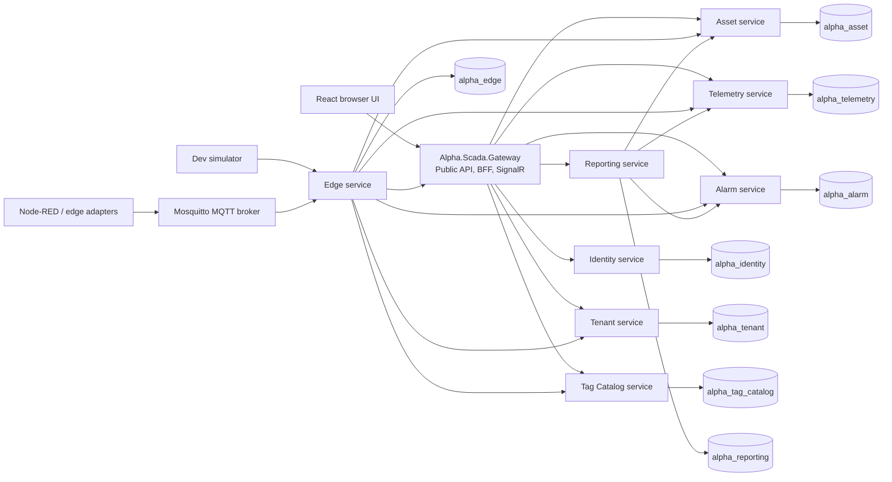
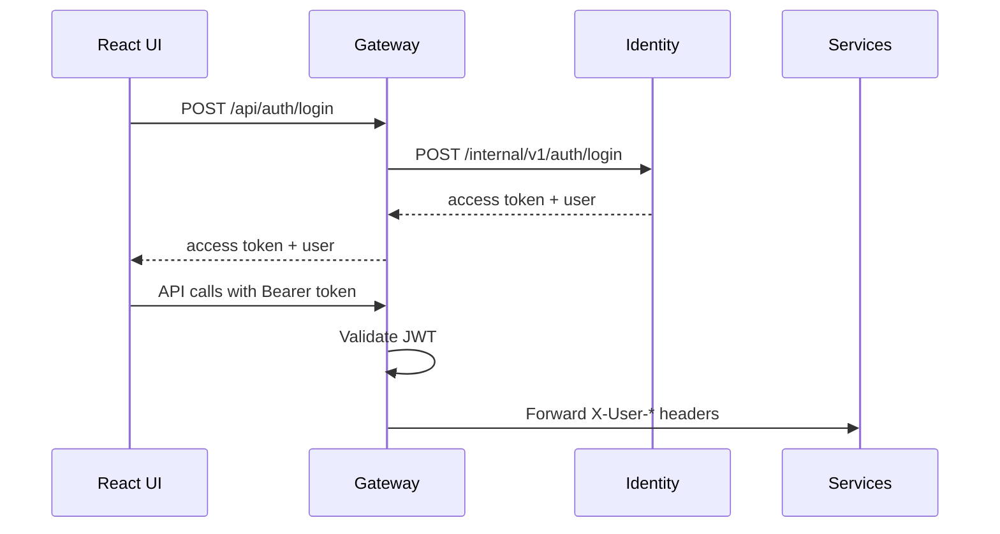
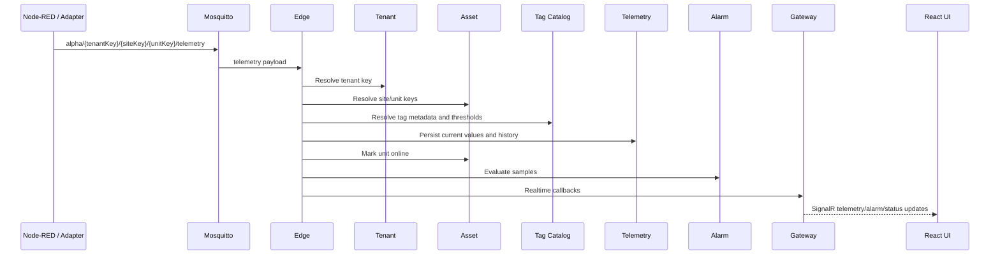
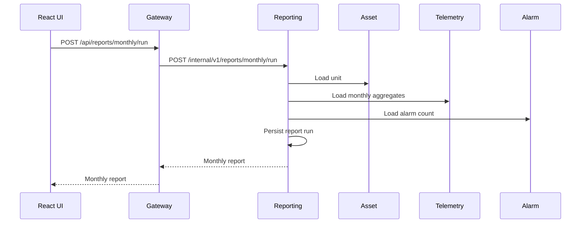

# Alpha SCADA System Overview

This document describes the current Alpha SCADA implementation after the microservices and Clean Architecture refactor. It is intended for engineers, solution architects, delivery leads, and operators who need to understand how the system is split, how data moves, and where to make code changes.

Architecture decisions:

- [ADR 002: Wolverine Messaging With MQTT And PostgreSQL](architecture-decisions/002-messaging.md)

Operations:

- [Messaging runbook](messaging-runbook.md)

## Purpose

Alpha SCADA is a lightweight open-source SCADA platform for small industrial energy sites. The current implementation focuses on:

- Multi-tenant site and unit monitoring.
- Edge ingestion through MQTT.
- Live telemetry, history, alarms, and monthly reporting.
- Browser-based operator UI.
- Low-cost deployment using Docker Compose locally and k3s manifests for production-like environments.

The application is generic and uses "Combined Heat and Power Unit" as the demo asset type. It is suitable for CHP/bioreactor sites without hard-coding a specific customer or vendor.

## Current Architecture

The backend is split into one public Gateway/BFF and eight domain services. The frontend only calls the Gateway. Domain services use HTTP for request/response queries and Wolverine-backed messaging for asynchronous commands/events. Each domain service owns its own PostgreSQL database.



## Service Responsibilities

| Service | Project | Owns | Main code locations |
| --- | --- | --- | --- |
| Gateway | `src/Alpha.Scada.Gateway` | Public REST API compatibility, BFF orchestration, SignalR hub, JWT validation | `Program.cs`, `Application/GatewayAuth.cs`, `Realtime/TelemetryHub.cs` |
| Identity | `src/Alpha.Scada.Identity` | Users, roles, password hashing, login/logout audit, JWT issuing | `Application/AuthService.cs`, `Infrastructure/IdentityRepository.cs`, `Infrastructure/PasswordHasher.cs` |
| Tenant | `src/Alpha.Scada.Tenant` | Tenant records and support-user tenant visibility | `Application/TenantService.cs`, `Infrastructure/TenantRepository.cs` |
| Asset | `src/Alpha.Scada.Asset` | Sites, units, unit status, unit key resolution, stale unit transitions, communication-loss monitor | `Application/AssetService.cs`, `Application/CommunicationLossMonitorWorker.cs`, `Infrastructure/AssetRepository.cs` |
| Tag Catalog | `src/Alpha.Scada.TagCatalog` | Subsystems, tag definitions, engineering units, threshold metadata | `Application/TagCatalogService.cs`, `Infrastructure/TagCatalogRepository.cs` |
| Edge | `src/Alpha.Scada.Edge` | MQTT worker, topic validation, legacy ingest fan-out, simulator | `Application/MqttIngestionWorker.cs`, `Application/EdgeTelemetryPipeline.cs`, `Application/ChpUnitSimulatorWorker.cs` |
| Telemetry | `src/Alpha.Scada.Telemetry` | Current tag values, partitioned telemetry history, report aggregates | `Application/TelemetryService.cs`, `Infrastructure/TelemetryRepository.cs` |
| Alarm | `src/Alpha.Scada.Alarm` | Alarm evaluation, active/acknowledged/cleared lifecycle, alarm counts | `Domain/AlarmRule.cs`, `Application/AlarmService.cs`, `Infrastructure/AlarmRepository.cs` |
| Reporting | `src/Alpha.Scada.Reporting` | Monthly report generation and report run persistence | `Application/ReportingService.cs`, `Infrastructure/ReportingRepository.cs` |

Shared projects:

- `src/Alpha.Scada.Contracts`: DTOs, public/internal contract records, roles, role rules.
- `src/Alpha.Scada.ServiceDefaults`: common PostgreSQL wiring, JWT helper, user header propagation, minimal health helpers.

Frontend:

- `src/Alpha.Scada.Web`: React/Vite single page app.
- `src/Alpha.Scada.Web/nginx.conf`: production container proxy rules that forward `/api`, `/hubs`, `/health`, `/ready`, and `/metrics` to the Gateway.

## Clean Architecture Shape

Domain services follow a lightweight Clean Architecture layout:

```text
Domain/          Entities, value objects, domain rules
Application/     Use-case services and orchestration inside the service boundary
Infrastructure/  Npgsql repositories, migrations, external adapters
Program.cs       Minimal API endpoints, dependency wiring, health/readiness/metrics
```

Gateway and Edge are intentionally thinner:

- Gateway is a BFF/orchestration boundary, so most code lives in `Program.cs`, `Application`, and `Realtime`.
- Edge is an integration service, so its core is workers plus an ingestion pipeline.

## Data Ownership

Development uses one PostgreSQL container, but each service has a separate logical database:

| Database | Owner |
| --- | --- |
| `alpha_identity` | Identity |
| `alpha_tenant` | Tenant |
| `alpha_asset` | Asset |
| `alpha_tag_catalog` | Tag Catalog |
| `alpha_edge` | Edge |
| `alpha_telemetry` | Telemetry |
| `alpha_alarm` | Alarm |
| `alpha_reporting` | Reporting |

Rules:

- A service must only read and write its own database.
- Cross-service data access goes through HTTP internal APIs.
- Database schemas are created by service migrators at startup.
- `ops/postgres/init.sql` creates the logical databases for local/dev.

## Runtime Data Flows

### Login And Frontend Access



The Gateway validates the JWT and forwards user identity to internal services using headers. Internal services enforce tenant scoping from those headers.

### Telemetry Ingestion



### Monthly Reporting



## Public Gateway API

The Gateway preserves the frontend-facing API shape:

```text
POST /api/auth/login
POST /api/auth/logout
GET  /api/me
GET  /api/tenants
GET  /api/sites
GET  /api/sites/{siteId}/units
GET  /api/units/{unitId}
GET  /api/units/{unitId}/tags/current
GET  /api/tags/{tagId}/history?minutes=30
GET  /api/alarms/active
POST /api/alarms/{alarmId}/ack
GET  /api/reports/monthly
POST /api/reports/monthly/run
GET  /health
GET  /ready
GET  /metrics
GET  /hubs/telemetry
```

Internal service APIs are under `/internal/v1/...`. They are not intended for direct frontend use.

## Edge MQTT Contract

Telemetry topic:

```text
alpha/{tenantKey}/{siteKey}/{unitKey}/telemetry
```

Example payload:

```json
{
  "schemaVersion": "1.0",
  "unitKey": "chp-demo-001",
  "timestampUtc": "2026-05-25T12:00:00Z",
  "samples": [
    {
      "tagKey": "engine.electrical_output_kw",
      "value": 58.2,
      "quality": "good",
      "sourceTimestampUtc": "2026-05-25T12:00:00Z"
    }
  ]
}
```

The Edge service validates:

- topic prefix is `alpha`;
- topic shape is `alpha/{tenantKey}/{siteKey}/{unitKey}/{kind}`;
- kind is `telemetry` for telemetry ingestion;
- payload schema version is `1.0`;
- payload `unitKey` matches the topic `unitKey`;
- tenant, site, unit, and tag keys resolve through service APIs.

Unknown tags are ignored. If no tag keys are known, the batch is rejected.

## Security Model

Current security is intentionally simple:

- Local users are stored in `alpha_identity`.
- Passwords use PBKDF2 hashing.
- Identity issues signed JWTs.
- Gateway validates JWTs.
- Gateway forwards user context to services with `X-User-*` headers.
- Services apply tenant scoping from the forwarded context.

Fixed roles:

| Role | Intended access |
| --- | --- |
| `Admin` | Full tenant administration and alarm acknowledgement |
| `Operator` | Operational workflows and alarm acknowledgement |
| `Viewer` | Read-only monitoring |
| `SupportEngineer` | Cross-tenant support visibility and acknowledgement |

OIDC is not wired yet. The current implementation keeps the local auth path working first.

## Observability And Operations

Every .NET service exposes:

```text
GET /health
GET /ready
GET /metrics
```

Local observability files:

- `ops/prometheus/prometheus.yml`: Prometheus scrape targets for all services.
- `ops/grafana/dashboards/alpha-scada.json`: starter Grafana dashboard.
- `ops/scripts/backup-postgres.sh`: backs up all service databases.
- `ops/scripts/restore-postgres.sh`: restores a named service database from a dump.

## Deployment

### Local Development

Use Docker Compose:

```bash
docker compose up --build
```

The browser UI is served at:

```text
http://localhost:8080
```

Gateway is also exposed directly at:

```text
http://localhost:5202
```

### Production-like k3s

Kubernetes manifests live under `ops/k3s`:

```text
namespace.yaml
config.yaml
postgres.yaml
mosquitto.yaml
services.yaml
frontend.yaml
```

The k3s manifests are intentionally simple:

- one replica per service;
- one PostgreSQL deployment for pilot use;
- one Mosquitto deployment;
- no HA clustering yet;
- no multi-region deployment yet.

## Code Navigation

Common change paths:

| Change | Where to start |
| --- | --- |
| Add or change a public frontend route | `src/Alpha.Scada.Gateway/Program.cs` |
| Add a domain DTO or shared request/response | `src/Alpha.Scada.Contracts/PlatformContracts.cs` |
| Add a telemetry tag definition | `src/Alpha.Scada.TagCatalog/Infrastructure/TagCatalogMigrator.cs` |
| Change telemetry persistence/history behavior | `src/Alpha.Scada.Telemetry/Infrastructure/TelemetryRepository.cs` |
| Change alarm threshold logic | `src/Alpha.Scada.Alarm/Domain/AlarmRule.cs` |
| Change monthly report calculations | `src/Alpha.Scada.Reporting/Application/ReportingService.cs` and `src/Alpha.Scada.Telemetry/Infrastructure/TelemetryRepository.cs` |
| Change MQTT ingestion behavior | `src/Alpha.Scada.Edge/Application/MqttIngestionWorker.cs` and `src/Alpha.Scada.Edge/Application/EdgeTelemetryPipeline.cs` |
| Change simulator values | `src/Alpha.Scada.Edge/Application/ChpUnitSimulatorWorker.cs` |
| Change frontend screens | `src/Alpha.Scada.Web/src/main.tsx` and `src/Alpha.Scada.Web/src/styles.css` |
| Change Docker service topology | `docker-compose.yml` |
| Change k3s service topology | `ops/k3s/services.yaml` |

## Verification Commands

```bash
dotnet build Alpha.Scada.slnx
dotnet test Alpha.Scada.slnx
cd src/Alpha.Scada.Web && npm run build
docker compose config -q
docker compose build
```

Expected non-blocking warnings:

- `.NET 10` route analyzer warning `AD0001` during build/publish.
- Vite/Rollup warning about SignalR pure annotations during frontend build.

Both warnings currently allow successful builds.

## Known Limitations

Still intentionally deferred:

- Sparkplug B.
- TimescaleDB.
- Outbox/event bus.
- HA PostgreSQL and service clustering.
- Multi-region deployment.
- OIDC provider integration.
- BESS optimization.
- Carbon-credit MRV.
- Predictive maintenance/fleet learning.
- CMMS/ERP/BI integrations.
- Cloud-to-device control or setpoints.
